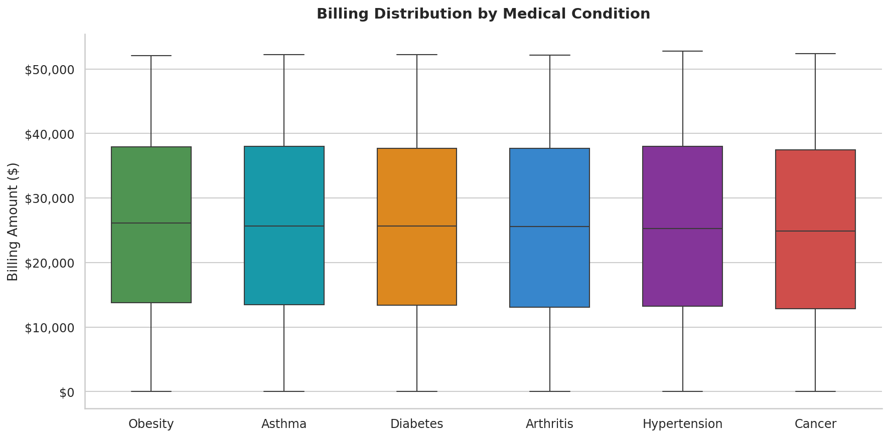
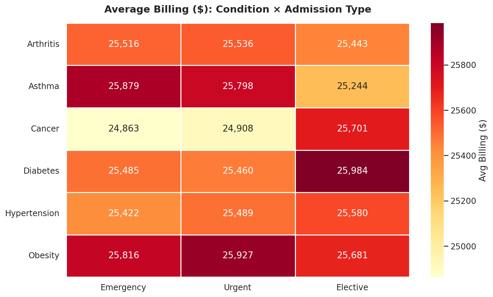
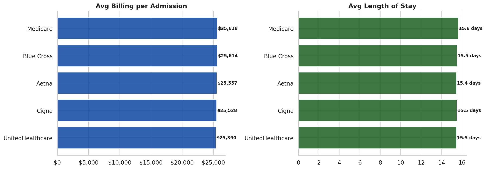
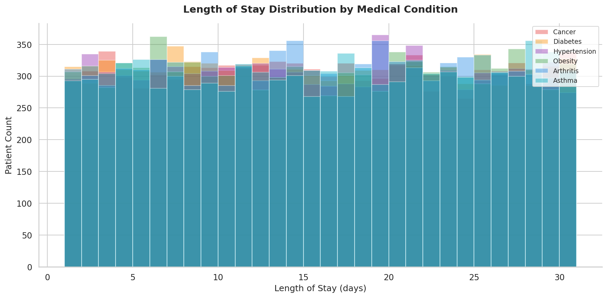
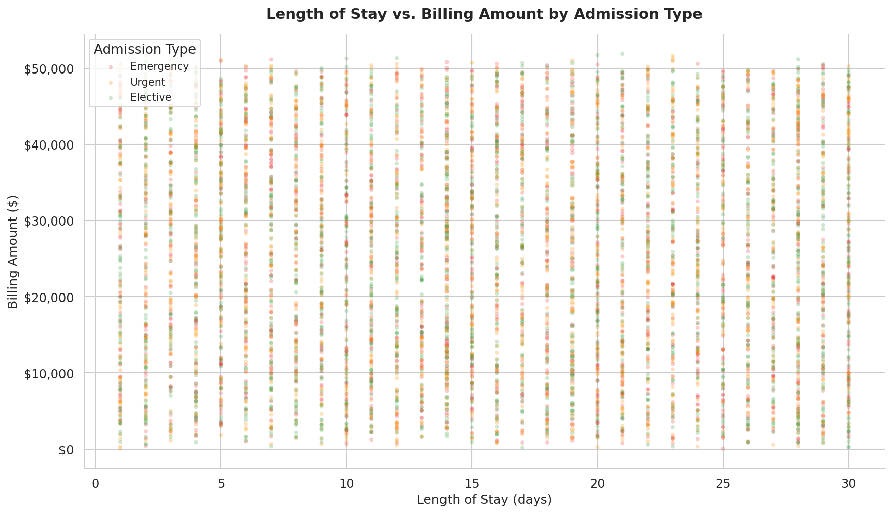
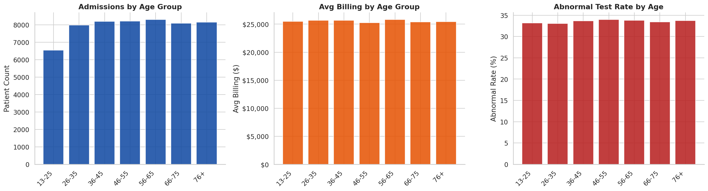
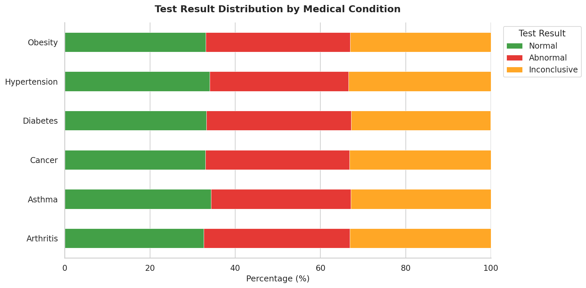
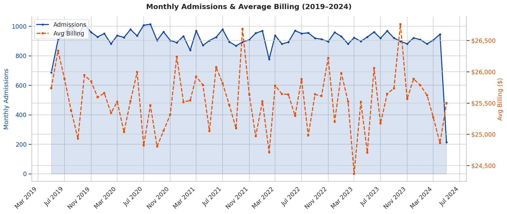
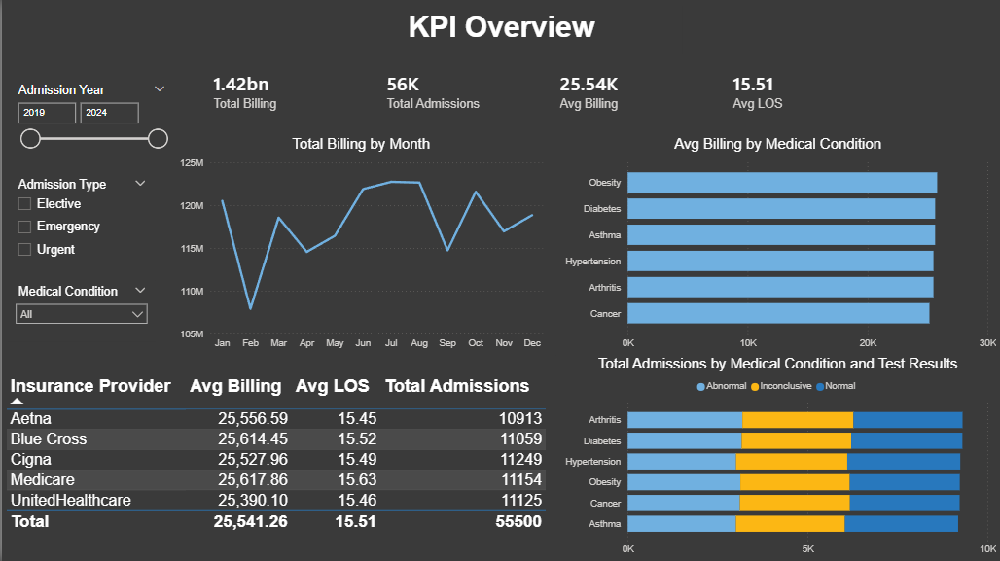
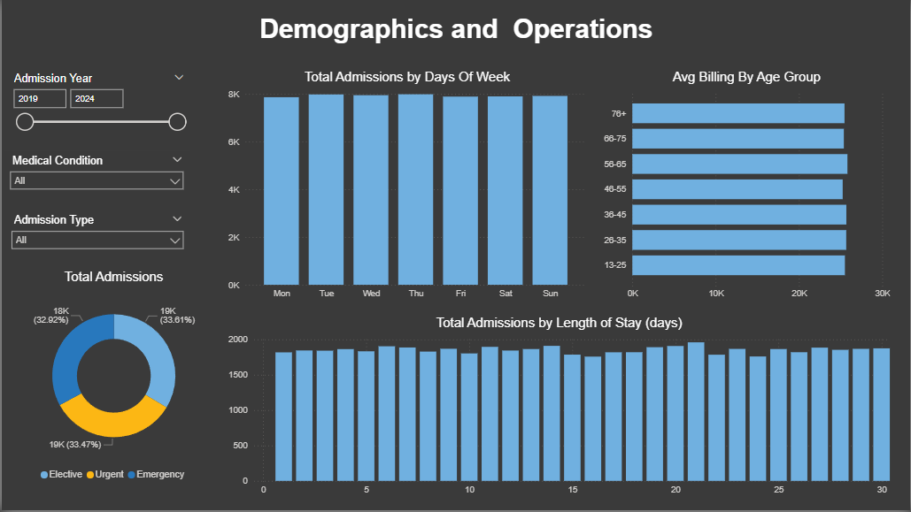

# Beyond the Bill
### Hospital Performance Analytics: Billing Drivers, Patient Outcomes & Operational Efficiency

End-to-end analysis of 55,500 hospital admissions across 6 chronic conditions, 5 insurance providers, and 3 admission types spanning 2019–2024. Covers billing pattern analysis, length-of-stay drivers, demographic outcome disparities, medication effectiveness, and operational trends. Built with Python (Pandas, Seaborn, Matplotlib) and SQL. Key finding: billing variance is driven more by individual case complexity (LOS) than by diagnosis or insurance provider — a critical insight for hospital cost management.

---

## Business Questions & Answers

### 1. What drives hospital billing? Is it the condition, admission type, insurance, or length of stay?

**Answer: Length of Stay is the primary billing driver — not the diagnosis itself.** Average billing is remarkably consistent across all 6 conditions (around $25,500), and all 3 admission types show nearly identical averages. This means the condition label alone doesn't predict cost. Instead, the wide billing range ($9–$52K) within each condition points to individual case complexity and LOS as the real cost drivers. A 2-day diabetes admission and a 28-day diabetes admission are fundamentally different resource consumers, yet both fall under "Diabetes." The daily cost metric ($3,387/day) is a more actionable lever for cost management than condition-level averages.

### 2. How long do patients stay? What factors influence length of stay?

**Answer: Average LOS is 15.5 days, uniformly distributed (1–30 days), with no single condition dominating extended stays.** LOS varies only marginally across conditions (15.4–15.7 days) and admission types (15.4–15.6 days). This uniform distribution suggests the hospital handles a broad mix of simple and complex cases across all diagnoses. The practical implication: resource planning should focus on total admission volume and outlier management (flagging stays >20 days), rather than staffing by condition type.

### 3. Are outcomes equitable? Do demographics or insurance affect test results?

**Answer: Yes — outcomes are remarkably equitable across all demographics.** Abnormal test result rates are stable at around 33% across every age group (13-25 through 76+), both genders, and all 5 insurance providers. There is no evidence of demographic or payer-driven disparities in clinical outcomes. This is a positive finding that the hospital can use in compliance reporting and insurance negotiations to demonstrate standardized care delivery.

### 4. How do insurers compare? Any billing or LOS differences across payers?

**Answer: All 5 insurers show nearly identical billing and LOS patterns.** Average billing ranges only from $25,400 to $25,700 across Cigna, Medicare, UnitedHealthcare, Blue Cross, and Aetna. Average LOS varies by less than 0.3 days. No insurer is associated with systematically shorter stays or lower costs. This means the hospital delivers consistent care regardless of payer — a strong negotiating position when renewing contracts.

### 5. What are the operational patterns? Admission trends, seasonality, day-of-week effects?

**Answer: Admissions are steady at around 900/month with slight weekday concentration and no meaningful seasonality.** Monthly volume is remarkably stable across 5 years (2019–2024), suggesting consistent demand rather than seasonal surges. Weekdays see slightly higher admission counts than weekends, which is typical for elective procedures. Emergency admissions represent around 33% of volume across all conditions. Peak planning should focus on weekday capacity rather than seasonal staffing adjustments.

---

## Dataset

- **Source**: [Healthcare Dataset](https://www.kaggle.com/datasets/prasad22/healthcare-dataset) (Kaggle)
- **Size**: 55,500 records × 15 features
- **Key variables**: Medical Condition, Billing Amount, Admission Type, Insurance Provider, Date of Admission, Discharge Date, Test Results, Medication, Age, Gender

## Project Structure

```
beyond-the-bill/
├── Data/
│   └── healthcare_dataset.csv           # Raw dataset (55,500 rows)
├── Output/
│   ├── healthcare_cleaned.csv           # Cleaned with derived features
│   ├── condition_summary.csv            # Full condition-level metrics
│   ├── insurance_provider_stats.csv     # Insurer comparison
│   ├── age_group_stats.csv              # Demographics analysis
│   ├── medication_stats.csv             # Medication effectiveness
│   ├── descriptive_statistics.csv       # Core descriptive stats
│   └── key_findings.txt                 # Written insights
├── Visualizations/
│   ├── 01_billing_by_condition.png      # Box plots
│   ├── 02_billing_heatmap.png           # Condition × Admission Type
│   ├── 03_insurance_comparison.png      # Billing & LOS by insurer
│   ├── 04_los_distribution.png          # LOS histograms by condition
│   ├── 05_los_vs_billing.png            # Scatter: LOS × Billing
│   ├── 06_age_group_analysis.png        # Triple-metric age breakdown
│   ├── 07_test_results_by_condition.png # Stacked outcome bars
│   ├── 08_monthly_admissions_trend.png  # Dual-axis time series
│   └── 09_day_of_week.png              # Weekly admission pattern
├── SQL_Queries/
│   └── analysis_queries.sql             # 10 queries: CTEs, window, CASE
├── analysis.py                          # Full pipeline (run this)
└── README.md
```

## Data Cleaning Steps

1. Parsed admission and discharge dates, calculated **Length of Stay** (Discharge − Admission)
2. Fixed **108 negative billing amounts** (converted to absolute values)
3. Fixed **invalid LOS** (≤0 days set to 1)
4. Standardized **name casing** (original had random capitalization like "DaNnY sMitH")
5. Created derived features: Age Group, Billing Tier, Daily Cost, time dimensions (year, month, quarter, day of week)

## Key Metrics at a Glance

| Metric | Value |
|--------|------:|
| Total Billing | $1.42B |
| Avg per Admission | $25,541 |
| Avg Length of Stay | 15.5 days |
| Avg Daily Cost | $3,387 |
| Total Admissions | 55,500 |

## Condition Summary

| Condition | Patients | Avg Billing | Avg LOS | Emergency % |
|-----------|:--------:|:-----------:|:-------:|:-----------:|
| Obesity | 9,231 | $25,808 | 15.5 | 33.9% |
| Diabetes | 9,304 | $25,640 | 15.4 | 32.4% |
| Asthma | 9,185 | $25,637 | 15.7 | 32.7% |
| Arthritis | 9,308 | $25,499 | 15.5 | 33.4% |
| Hypertension | 9,245 | $25,499 | 15.5 | 32.5% |
| Cancer | 9,227 | $25,164 | 15.5 | 32.7% |

## Visualizations

| Billing by Condition | Billing Heatmap |
|:---:|:---:|
|  |  |

| Insurance Comparison | LOS Distribution |
|:---:|:---:|
|  |  |

| LOS vs Billing | Age Group Analysis |
|:---:|:---:|
|  |  |

| Test Results by Condition | Monthly Admissions Trend |
|:---:|:---:|
|  |  |

## Interactive Dashboard (Power BI)

Built two interactive Power BI dashboards for KPI Overview and Demographic & Operations
Download the .pbix file from the `dashboard/` folder to explore interactively.





## Skills Demonstrated

- **Python**: Pandas (55K-row data, datetime handling, pivot tables, groupby), Seaborn, Matplotlib
- **SQL**: Multi-condition aggregations, CTEs, window functions (LAG, RANK), CASE expressions
- **Analytics**: KPI dashboards, billing analysis, LOS modeling, demographic analysis, outcome comparisons
- **Data Cleaning**: Negative value handling, date parsing, feature engineering, outlier detection

## How to Run

```bash
pip install pandas numpy seaborn matplotlib
python analysis.py
```

## Author

**Ernesto** — Data Analyst | Berlin, Germany
